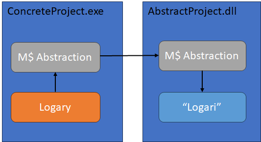

# Logari

Logari is a set of 2 tools to help to use (or replace) [Logary](https://logary.github.io/) interface via 
[Microsoft.Extensions.Logging.Abstractions](https://www.nuget.org/packages/microsoft.extensions.logging.abstractions/)

This can be used to abstract Logary behind Microsoft.Extensions.Logging so it's easier to remove or migrate from existing infra.

This repository contains code for two different Nuget packages:

### Logari

- Logari is a totally independent wrapper of Microsoft.Extensions.Logging.Abstractions. It coincidently happens to match the user-experience of Logary, which has a very nice structured logging API.
- So you use Logari just like the old Logary, the only difference is that "y" is "i" and the internal objects (you don't have to care about) are abstraction-objects like M$ ILogger and CustomMessage instead of the Logary ones.
- That means the user can reference your DLL and use whichever logging framework they want (Serilog, AspNetCore logging, Logary.Logari, or whatever), and your Logary-style logging can be directly injected to it if desired.
- This is a set of abstract interfaces Microsoft.Extensions.Logging.Abstractions and is not dependent on a concrete logging framework like Logary.
- In the picture below, see "Logari" and "AbstractProject.dll"

### Logari.Logary

- Logary-implementation of Microsoft.Extensions.Logging.Abstractions 
- So you can register your Logary as a concrete logging framework for any project using Microsoft.Extensions.Logging.Abstractions
- This way you can get Logary to log messages from whatever dependency that uses the new Microsoft.Extensions.Logging.Abstractions
- This project does have dependencies on both Logary and Microsoft.Extensions.Logging.Abstractions
- In the picture below, see "Logary" and "ConcreteProject.exe"
- This package uses Logary 4 in .NET Framework 4.8 and .NET Standard 2.0, and Logary 5 in .NET 8.0. Before using this in .NET 8.0, please note the changed T&Cs between Logary 4 and Logary 5.

### Example usage

